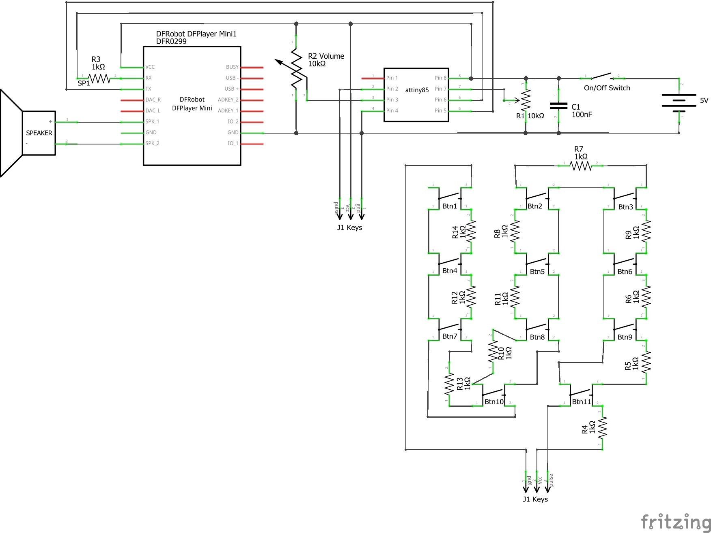

# KidsMP3Player
MP3 player for kids based on DFPlayer mini and ATTiny


## Features
* Up to 32 GB audio playback (MP3, WAV, WMA) in 11 play lists
* 50+h continuous playback (medium volume)
* Sleep timer (5 - 50 minutes) with fade out
* Parental maximum volume control
* Configurable: Continuous play ON/OFF, play list loop ON/OFF

## Build Ingredients
* IKEA Bamboo box DRAGAN as body
* 4mm poplar for front and back
* Wooden handle (hardware store)
* Visaton 8006 Speaker
* Mini DFPlayer
* ATTiny85
* 2200mAh Powerbank
* Göldo Dome Chrome (KB02C)
* Skrews, nuts, washers, resistors, pots, switch, hot glue...

## Usage Instructions
* Push playlist button 1-11 to start playing the corresponding playlist. Push button again to move on to the next track within that playlist.
* Hold down button 1 for more than 2 secs to toggle between "Continuous Play ON/OFF"
* Hold down button 2 for more than 2 secs to toggle between "Playlist loop ON/OFF" (only applicable if "Continuous Play" is ON) 
* Hold down button 11 for more than 2 secs to activate Sleep Timer. Afterwards push button 1 to 11 to choose between OFF and 5 to 50 minutes sleep timer. Device will fade out volume after sleep timer has run out. When device has gone to sleep you need to switch it off and on again to continue playing.
* Use internal volume pot to set maximum volume of normal volume pot.
* [User Manual](assets/Manual%20German.pdf)

## Schematics


## Mini SD Card File Structure
```
/01 - Playlist Button 1]
   001.mp3 - First track in playlist 1
   002.mp3
/02
   ...
/..
/11
   ...  
/ADVERT
    0001.mp3 - Audio file "Sleep Timer OFF"
    0002.mp3 - Audio file "Sleep Timer 5 mins"
    0003.mp3 - Audio file "Sleep Timer 10 mins"
    0004.mp3 - Audio file "Sleep Timer 15 mins"
    0005.mp3 - Audio file "Sleep Timer 20 mins"
    0006.mp3 - Audio file "Sleep Timer 25 mins"
    0007.mp3 - Audio file "Sleep Timer 30 mins"
    0008.mp3 - Audio file "Sleep Timer 35 mins"
    0009.mp3 - Audio file "Sleep Timer 40 mins"
    0010.mp3 - Audio file "Sleep Timer 45 mins"
    0011.mp3 - Audio file "Sleep Timer 50 mins"
    0100.mp3 - Audio file "Mode Set Sleep Timer"
    0200.mp3 - Audio file "Continuous Play ON"
    0201.mp3 - Audio file "Continuous Play OFF"
    0300.mp3 - Audio file "Playlist Loop ON"
    0301.mp3 - Audio file "Playlist Loop OFF"
/MP3
    [Copy same content as in /ADVERT here]
```

## More Pictures


